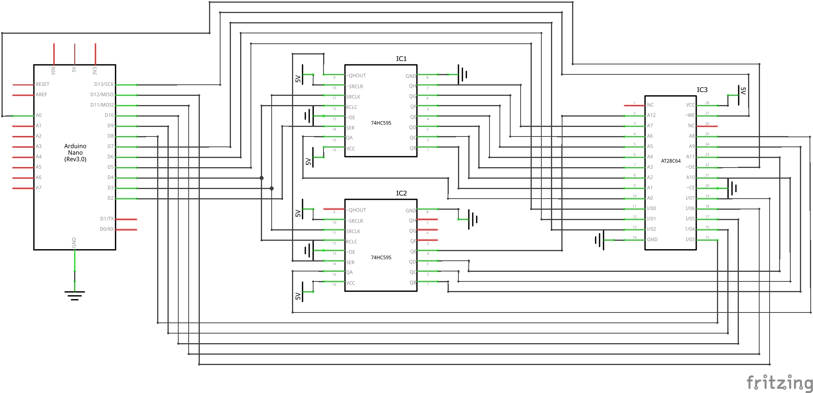

# Arduino EEPROM Programmer

This project uses an *Arduino* as a `parallel EEPROM` programmer.

The circuit is based on [Ben Eater's](https://github.com/beneater/eeprom-programmer) work.

The approach to the software component though is rather different.  Ben included the data to be written to the Arduino in the actual sketch.  This project uses a client-side application which drives an Arduino sketch via a protocol.  

The application can:

* Read requested data from an EEPROM.
* Write a binary file to an EEPROM.
* Erase an EEPROM.
* Check whether an EEPROM is empty.

The code and circuit targets the `AT28HC64` EEPROM, but should be easily adapted to similar ICs.

The project was created to write the decoder EEPROMs and microcode EEPROMs used in the [diy-cpu](https://github.com/skagra/diy-cpu) project.

# Software Installation and Execution

The code is in two sub-directories:

* *Arduino* - An Arduino "sketch" which should be built and uploaded.  Build using either the Arduino IDE or VSCode + the Arduino extensions.
* *client* - The client-side application to run on a PC.  This is a *C#/dotnet* application, run it by executing `dotnet run` in the `client` directory. 

# Circuit



# The protocol

The PC-based client application uses a simple protocol to communicate with the Arduino.

Each protocol packet has the following structure:

```
| Packet size (byte) | Op code (byte) | Payload |
```

* `Packet size` - The packet size does not include the size byte itself.
* `Op code` - Indicates the required operation.
* `Payload` - Packet payload which is dependent on the `Op code`.

| Op code name         | Op code value | Direction     | Payload                                                            |
| -------------------- | ------------- | ------------- | ------------------------------------------------------------------ |
| READ_BLOCK_REQUEST   | 0x01          | PC -> Arduino | 16 bit block number to read                                        |
| READ_BLOCK_RESPONSE  | 0x02          | Arduino -> PC | Data block read from EEPROM                                        |
| WRITE_BLOCK_REQUEST  | 0x03          | PC -> Arduino | 16 bit block number, followed by data block to write to the EEPROM |
| WRITE_BLOCK_RESPONSE | 0x04          | Arduino -> PC | -                                                                  |

* 16 bit integers are little-endian encoded.
* Data blocks are 64 bytes in length.

